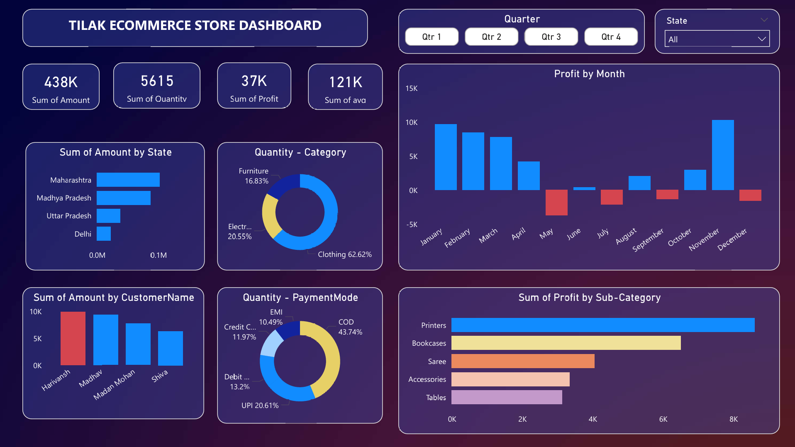

# 📊 E-Commerce Sales Dashboard (Power BI)

## 🔹 Project Overview  
This project is an **interactive sales dashboard** built in **Power BI** for analyzing an e-commerce store’s performance.  
It provides clear insights into **sales, profit, customer behavior, and regional performance**, helping businesses make data-driven decisions.  

---

## 🔹 Dashboard Preview  

---

## 🔹 Dashboard Insights  
- **Profit by Month** – Track seasonal sales and profitability trends  
- **Profit by Sub-Category** – Identify top-performing and low-performing products  
- **Sales by Category & Payment Mode** – Understand customer purchase behavior  
- **Sales by State** – Discover high and low revenue regions  
- **Sales by Customer** – Pinpoint valuable customers  

🔹 Key Metrics

💰 Total Sales: ₹438K

📦 Total Quantity Sold: 5615

📊 Average Sales Value: ₹121K

🏆 Total Profit: ₹37K

🔹 Tools & Skills Used

Power BI Desktop

DAX (Data Analysis Expressions)

Data Cleaning & Transformation

Interactive Visuals & KPIs

🔹 About Me

I’m passionate about data analysis and visualization, and I love turning raw data into actionable insights.
👉 Connect with me on LinkedIn
https://www.linkedin.com/in/tilak-malviya-6596512b8/

⭐ Don’t forget to star this repo if you find it helpful!
